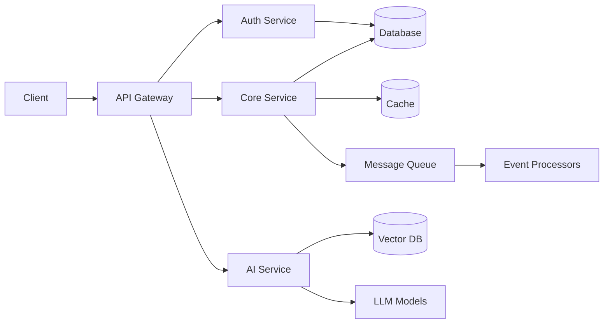
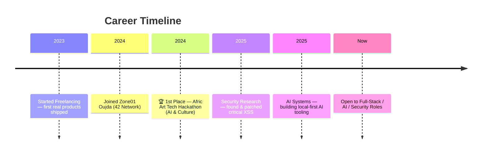

```markdown
<div align="center">


<a href="https://git.io/typing-svg">
  
</a>

<br/><br/>

<a href="https://www.linkedin.com/in/YOUR-LINKEDIN"></a>
<a href="mailto:YOUR-EMAIL"></a>
<a href="https://YOUR-PORTFOLIO.com"></a>
<a href="https://twitter.com/YOUR-HANDLE"></a>
<a href="https://discord.gg/YOUR-DISCORD"></a>
<a href="https://calendly.com/YOUR-LINK"></a>

<br/><br/>


</div>

<br/>

<div align="center">


</div>

<br/>

<table align="center" width="900" cellspacing="0" cellpadding="0">
<tr>
<td width="450" valign="top">

<table cellspacing="0" cellpadding="16" width="100%" style="background:rgba(0,240,255,0.03);border:1px solid rgba(0,240,255,0.15);border-radius:12px;">
<tr><td>

### ⚡ At a Glance

```yaml
⚡ Quick Profile:
  💼 Role: Full-Stack Engineer
  🔐 Specialty: Security Researcher
  🤖 Focus: AI Systems Builder
  📍 Base: Oujda, Morocco 🇲🇦
  🌍 Availability: Remote Worldwide
  ☕ Core: Go • Java • Spring Boot • React • AI
```

</td></tr>
</table>

</td>
<td width="450" valign="top">

<table cellspacing="0" cellpadding="16" width="100%" style="background:rgba(0,240,255,0.03);border:1px solid rgba(0,240,255,0.15);border-radius:12px;">
<tr><td>

### 🧭 Currently Building

🧠 CoachMind AI Platform  
🔐 Offensive Security Labs  
☁️ AWS Serverless Architecture  
🤖 Local AI Ecosystem  
📚 Algorithms & System Design  

</td></tr>
</table>

</td>
</tr>
</table>

<br/>

<table align="center" width="900" cellspacing="0" cellpadding="0">
<tr>
<td valign="top">

<table cellspacing="0" cellpadding="18" width="100%" style="background:rgba(0,240,255,0.03);border:1px solid rgba(0,240,255,0.15);border-radius:12px;">
<tr><td>

```yaml
whoami:
  name: Mehdi Moulabbi
  base: Oujda, Morocco 🇲🇦
  trained_at: Zone01 Oujda (42 network — peer-learning, no lectures, no excuses)
  experience: ~3 years shipping real products, freelance + solo builds
  status: open to full-stack / SDET roles — Morocco · Canada · France · Remote EU
  known_for:
    - 1st place, Afric Art Tech Hackathon (AI & Culture)
    - Found + patched a high-severity stored XSS in a live blog platform
    - Builds AI systems locally instead of renting them from an API
  currently_learning:
    - AWS Serverless (Lambda, API Gateway, DynamoDB)
    - Advanced OWASP + Burp Suite for offensive security
  philosophy: "Great software is built twice: first in the mind, then in code."
```

</td></tr>
</table>

</td>
</tr>
</table>

<br/>

<div align="center">


### 🧬 TECH MATRIX

<br/>

<table cellspacing="0" cellpadding="20" width="900" style="background:rgba(0,240,255,0.03);border:1px solid rgba(0,240,255,0.15);border-radius:12px;">
<tr>
<td valign="top" width="33%">

**Languages**  


</td>
<td valign="top" width="33%">

**Backend**  
  
`REST` `gRPC`

</td>
<td valign="top" width="33%">

**Frontend**  


</td>
</tr>
</table>

<br/>

<table cellspacing="0" cellpadding="20" width="900" style="background:rgba(0,240,255,0.03);border:1px solid rgba(0,240,255,0.15);border-radius:12px;">
<tr>
<td valign="top" width="25%">

**Database**  


</td>
<td valign="top" width="25%">

**DevOps**  


</td>
<td valign="top" width="25%">

**AI / Automation**  
`Ollama` `LangChain` `n8n`  
`ChromaDB` `Whisper` `CUDA`  
`Claude API` `RAG Pipelines`

</td>
<td valign="top" width="25%">

**Security**  
`Burp Suite` `Nmap`  
`Wireshark` `Metasploit`  
`Kali Linux` `OWASP`

</td>
</tr>
</table>

</div>

<br/>

<div align="center">


### 🏗 ENGINEERING ARCHITECTURE

<br/>



<br/>

<table cellspacing="0" cellpadding="18" width="900" style="background:rgba(0,240,255,0.03);border:1px solid rgba(0,240,255,0.15);border-radius:12px;">
<tr>
<td valign="top" width="50%">

**Core Principles**  
✔ Microservices Architecture  
✔ Clean Architecture  
✔ Hexagonal Architecture  
✔ REST & gRPC APIs  
✔ Event-driven Systems  
✔ CI/CD Pipelines  
✔ Docker Containerization  

</td>
<td valign="top" width="50%">

**Security & AI**  
✔ JWT & OAuth 2.0  
✔ RAG Pipelines  
✔ Prompt Engineering  
✔ Security Testing  
✔ OWASP Top 10  
✔ Threat Modeling  
✔ Zero Trust Design  

</td>
</tr>
</table>

</div>

<br/>

<div align="center">


### 🛡 SECURITY ARSENAL

<br/>

<table cellspacing="0" cellpadding="18" width="900" style="background:rgba(0,240,255,0.03);border:1px solid rgba(0,240,255,0.15);border-radius:12px;">
<tr>
<td valign="top" width="33%">

**Offensive Tools**  
`Burp Suite Pro` `Nmap`  
`Wireshark` `Metasploit`  
`Kali Linux` `SQLMap`

</td>
<td valign="top" width="33%">

**Web Vulnerabilities**  
`XSS` (Stored/Reflected)  
`SQL Injection` `CSRF`  
`SSRF` `IDOR`  
`Broken Auth` `Mass Assignment`

</td>
<td valign="top" width="33%">

**Methodology**  
`OWASP Top 10` `OWASP ASVS`  
`Threat Modeling`  
`Penetration Testing`  
`Security Code Review`  
`Incident Response`

</td>
</tr>
</table>

</div>

<br/>

<div align="center">


### 🛰️ ACTIVE BUILDS

<br/>

<table cellspacing="0" cellpadding="0" width="900">
<tr>
<td width="50%" valign="top" style="padding-right:8px;">

<table cellspacing="0" cellpadding="18" width="100%" style="background:rgba(0,240,255,0.04);border:1px solid rgba(0,240,255,0.15);border-radius:12px;">
<tr><td>

⚽ **CoachMind AI**  
*Football Intelligence Platform*  

[](https://golang.org)
[](https://reactjs.org)
[](https://www.postgresql.org)
[](https://openai.com)

• Tactical analytics engine  
• RAG-powered scouting assistant  
• Real-time match insights  
• Scalable microservices arch  

[GitHub](https://github.com) · [Demo](https://example.com)

</td></tr>
</table>

</td>
<td width="50%" valign="top" style="padding-left:8px;">

<table cellspacing="0" cellpadding="18" width="100%" style="background:rgba(0,240,255,0.04);border:1px solid rgba(0,240,255,0.15);border-radius:12px;">
<tr><td>

🔐 **01Blog Security Audit**  
*Full Pentest Report*  

[](https://spring.io)
[](https://angular.io)
[](https://owasp.org)

• 120+ test cases executed  
• High-severity stored XSS caught  
• Complete patch documentation  
• OWASP methodology applied  

[GitHub](https://github.com) · [Report](https://example.com)

</td></tr>
</table>

</td>
</tr>
<tr>
<td width="50%" valign="top" style="padding-right:8px;padding-top:16px;">

<table cellspacing="0" cellpadding="18" width="100%" style="background:rgba(0,240,255,0.04);border:1px solid rgba(0,240,255,0.15);border-radius:12px;">
<tr><td>

🛟 **Still Here**  
*Safety-Monitoring Platform*  

[](https://reactnative.dev)
[](https://golang.org)
[](https://www.postgresql.org)

• Offline-detection architecture  
• AI companion named Vera  
• Real-time safety alerts  
• Cross-platform mobile  

[GitHub](https://github.com) · [Demo](https://example.com)

</td></tr>
</table>

</td>
<td width="50%" valign="top" style="padding-left:8px;padding-top:16px;">

<table cellspacing="0" cellpadding="18" width="100%" style="background:rgba(0,240,255,0.04);border:1px solid rgba(0,240,255,0.15);border-radius:12px;">
<tr><td>

🧠 **Neumann**  
*Local AI Desktop Assistant*  

[](https://python.org)
[](https://electronjs.org)
[](https://developer.nvidia.com)

• Fully local — no cloud dependency  
• Voice interface + memory  
• Multi-LLM routing engine  
• Self-improvement loop  

[GitHub](https://github.com) · [Demo](https://example.com)

</td></tr>
</table>

</td>
</tr>
<tr>
<td width="50%" valign="top" style="padding-right:8px;padding-top:16px;">

<table cellspacing="0" cellpadding="18" width="100%" style="background:rgba(0,240,255,0.04);border:1px solid rgba(0,240,255,0.15);border-radius:12px;">
<tr><td>

🌐 **Joumlaty**  
*Services Marketplace*  

[](https://openjdk.org)
[](https://spring.io)
[](https://reactjs.org)
[](https://www.mysql.com)

• Service provider matching  
• Payment integration  
• Rating & review system  
• Geolocation search  

[GitHub](https://github.com) · [Demo](https://example.com)

</td></tr>
</table>

</td>
<td width="50%" valign="top" style="padding-left:8px;padding-top:16px;">

<table cellspacing="0" cellpadding="18" width="100%" style="background:rgba(0,240,255,0.04);border:1px solid rgba(0,240,255,0.15);border-radius:12px;">
<tr><td>

💬 **Social Network**  
*Full-Stack Social Platform*  

[](https://www.typescriptlang.org)
[](https://nodejs.org)
[](https://www.mongodb.com)
[](https://redis.io)

• Real-time messaging  
• Feed algorithm  
• Media uploads  
• Notification system  

[GitHub](https://github.com) · [Demo](https://example.com)

</td></tr>
</table>

</td>
</tr>
</table>

</div>

<br/>

<div align="center">


### 📅 JOURNEY

<br/>



</div>

<br/>

<div align="center">


### 📡 GITHUB SIGNAL

<br/>


<br/><br/>


<br/><br/>


</div>

<br/>

<div align="center">


### 🏆 TROPHY CASE

<br/>


</div>

<br/>

<div align="center">


<br/>

<table cellspacing="0" cellpadding="18" width="900" style="background:rgba(0,240,255,0.03);border:1px solid rgba(0,240,255,0.15);border-radius:12px;">
<tr>
<td valign="top" width="33%">

### 📜 Certifications

✔ Zone01 Oujda (42 Network)  
✔ AWS (Currently Learning)  
✔ Burp Suite Academy  
✔ TryHackMe  
✔ Hack The Box  

</td>
<td valign="top" width="33%">

### 🌍 Languages

🇬🇧 English — Fluent  
🇫🇷 French — Fluent  
🇲🇦 Arabic — Native  
🇪🇸 Spanish — Learning  

</td>
<td valign="top" width="33%">

### 🎯 Looking For

Remote Full-Stack Engineer  
Backend Engineer (Go/Java)  
AI Engineer  
SDET  
Security Engineer  

</td>
</tr>
</table>

</div>

<br/>

<div align="center">


### 📈 CONTRIBUTION FLOW

<br/>

<picture>
  <source media="(prefers-color-scheme: dark)" srcset="https://raw.githubusercontent.com/platane/snk/output/github-contribution-grid-snake-dark.svg" />
  <source media="(prefers-color-scheme: light)" srcset="https://raw.githubusercontent.com/platane/snk/output/github-contribution-grid-snake.svg" />
  
</picture>

<sub>⚠️ requires a one-time GitHub Action setup — see [platane/snk](https://github.com/platane/snk)</sub>

</div>

<br/>

<div align="center">


<br/>

<table cellspacing="0" cellpadding="24" width="900" style="background:rgba(0,240,255,0.04);border:1px solid rgba(0,240,255,0.2);border-radius:12px;">
<tr><td align="center">

### 🤝 Let's Build Something

<br/>

<a href="https://www.linkedin.com/in/YOUR-LINKEDIN"></a>
<a href="mailto:YOUR-EMAIL"></a>
<a href="https://YOUR-PORTFOLIO.com"></a>
<a href="https://discord.gg/YOUR-DISCORD"></a>
<a href="https://calendly.com/YOUR-LINK"></a>

<br/><br/>

> *"Great software is built twice: first in the mind, then in code."*

</td></tr>
</table>

</div>

<br/>

<div align="center">


</div>

<br/>


```
